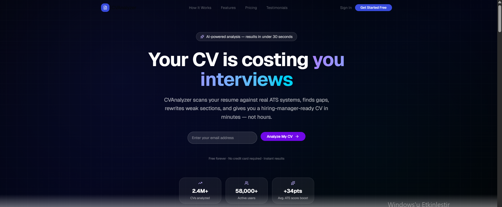
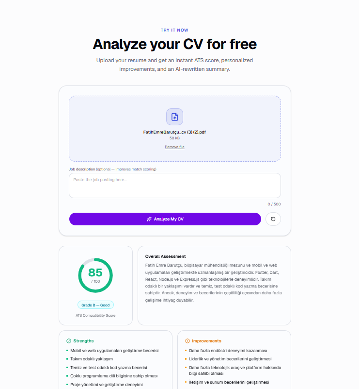

# 🤖 CV Analyzer — AI-Powered Resume Scanner

An intelligent CV analysis tool that scans your resume against ATS systems and provides instant improvement suggestions powered by Groq AI.

## 🔗 Live Demo
[cv-analyzer-kohl.vercel.app](https://cv-analyzer-kohl.vercel.app)

## 📷 Screenshots




## ✨ Features
- Groq LLM (Llama 3.3) integration for instant CV analysis
- ATS compatibility score (0-100)
- Keyword gap analysis
- Strengths & improvement suggestions
- PDF and DOCX file support

## 🔒 Security
- Mozilla Observatory **A+ (120/100)** — 10/10 tests passed
- Nonce-based Content Security Policy (CSP)
- CORS protection
- Rate limiting (5 req/hour/IP)
- Magic bytes file validation
- Prompt injection prevention

## 🛠️ Tech Stack
- Next.js 15
- TypeScript
- Tailwind CSS
- Groq AI API
- Vercel

## 🚀 Getting Started
```bash
git clone https://github.com/FatihEmreBARUTCU0/CV_analyzer
cd CV_analyzer
npm install
# .env.local dosyası oluştur
# GROQ_API_KEY=your_key_here
npm run dev
```
